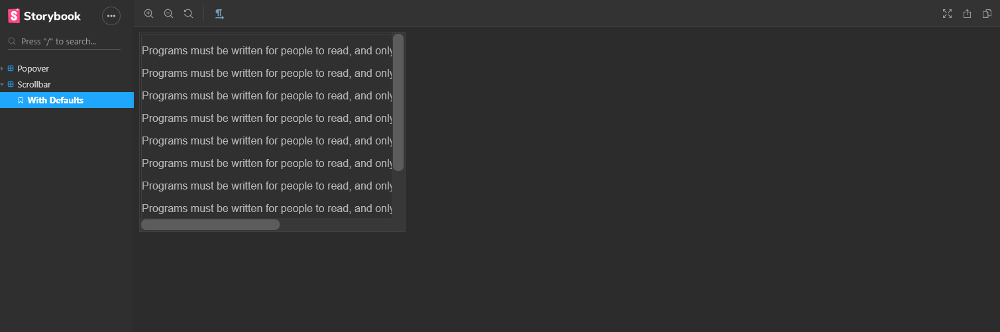

# storybook-rtl-addon

A storybook addons that lets your users toggle between ltr and rtl.



## Installation

Install the following npm module:

```sh
npm i --save-dev storybook-rtl-addon
```

or with yarn:

```sh
yarn add -D storybook-rtl-addon
```

Then, add following content to .storybook/addons.js

```js
import 'storybook-rtl-addon/register';
```

## Story integration

Use hook to get current direction:

```js
import { useDirection } from 'storybook-rtl-addon';

function MyComponent(props) {
  const direction = useDirection();
  return <div dir={direction}>{children}</div>;
}
```

Or use it by addDecorator:

```js
import { addDecorator } from '@storybook/react';
import { withDirection } from 'storybook-rtl-addon';

addDecorator(withDirection);
```

You can also listen for the direction change event as follow:

```js
import addons from '@storybook/addons';
import { Direction_MODE_EVENT_NAME } from 'storybook-rtl-addon';

// get channel to listen to event emitter
const channel = addons.getChannel();

// create a component that listens for the event change
function ThemeWrapper(props) {
  // this example uses hook but you can also use class component as well
  const [direction, setDirection] = useState();

  useEffect(() => {
    // listen to direction change
    channel.on(Direction_MODE_EVENT_NAME, setDirection);
    return () => channel.off(Direction_MODE_EVENT_NAME, setDirection);
  }, [channel, setDirection]);

  return <div dir={direction}>{children}</div>;
}
```
